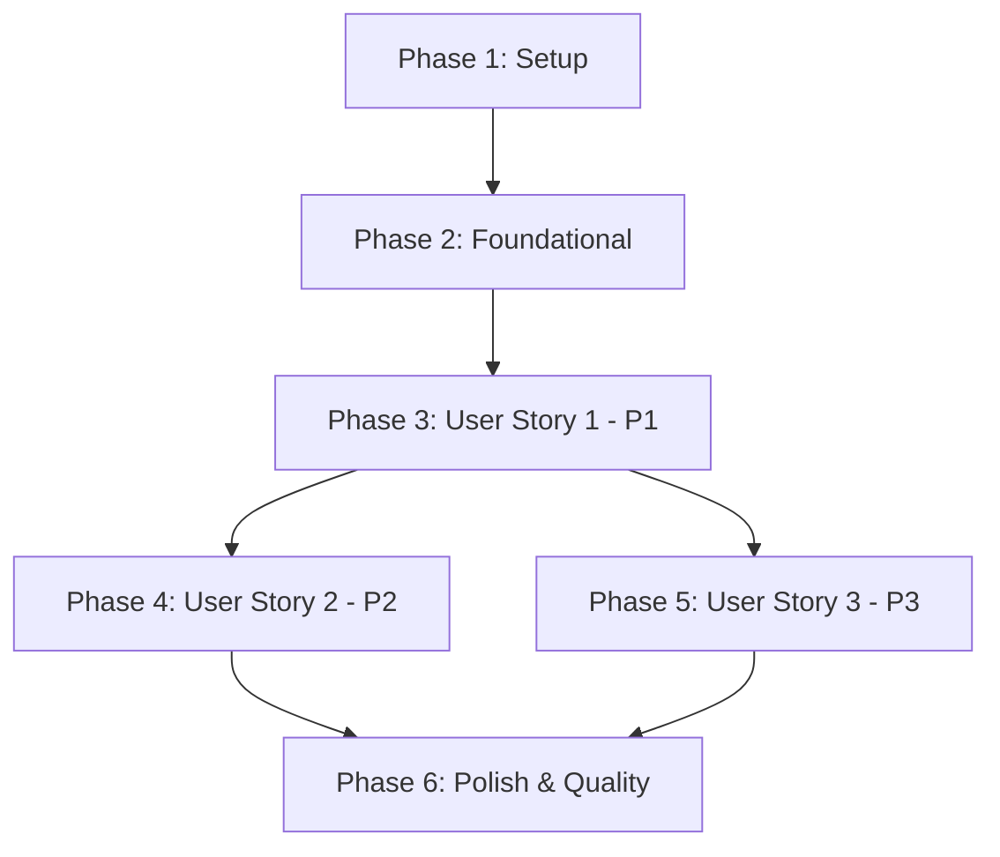

# Implementation Tasks: Privacy Policy Page

**Feature**: Privacy Policy Page  
**Branch**: `004-privacy-policy-page`  
**Spec**: [spec.md](./spec.md) | **Plan**: [plan.md](./plan.md)  
**Generated**: October 21, 2025

## Overview

This document provides granular, executable tasks for implementing the Privacy Policy page feature. Tasks are organized by user story to enable independent implementation and testing. The feature reuses proven component architecture from Spec 003 (Terms and Conditions page).

**Total Estimated Time**: 6-9 hours  
**Complexity**: Low (static content, proven patterns)  
**Risk**: Low (no database changes, reusing tested components)

---

## Task Organization

Tasks are grouped into phases matching user story priorities from the specification:

- **Phase 1**: Setup (branch verification, environment)
- **Phase 2**: Foundational (shared infrastructure, no blocking tasks)
- **Phase 3**: User Story 1 (P1) - View Privacy Policy Before Registration
- **Phase 4**: User Story 2 (P2) - Access Privacy Policy While Logged In
- **Phase 5**: User Story 3 (P3) - Reference Specific Privacy Sections
- **Phase 6**: Polish & Quality Checks

**Legend**:
- `[P]` = Parallelizable task (can be done simultaneously with other [P] tasks)
- `[US#]` = User Story number this task belongs to
- Task IDs: T001, T002, T003... (sequential execution order)

---

## Phase 1: Setup

**Goal**: Verify branch and environment are ready for implementation

**Tasks**:

- [X] T001 Verify feature branch 004-privacy-policy-page is checked out
- [X] T002 Verify Next.js dev server runs without errors (`npm run dev`)
- [X] T003 Verify Jest test suite runs (`npm test -- --listTests`)
- [X] T004 Verify Playwright is configured (`npx playwright --version`)
- [X] T005 Review existing Terms page components in `src/components/atoms/TermsSection.js` and `src/components/organisms/TermsContent.js` for architecture reference

**Estimated Time**: 30 minutes

---

## Phase 2: Foundational

**Goal**: No blocking foundational tasks required (feature reuses existing infrastructure)

**Note**: This phase is intentionally empty. All privacy page components are independently testable and do not require shared infrastructure beyond what already exists from Spec 003 (Terms page).

---

## Phase 3: User Story 1 - View Privacy Policy Before Registration (Priority: P1)

**Story Goal**: New users can access and review the privacy policy before creating an account, understanding how their personal data and health information will be collected, used, and protected.

**Independent Test Criteria**: Navigate to /privacy from registration page, verify complete privacy policy is visible with all 10 sections, scroll through content, verify proper formatting and readability.

### Component Tests (TDD - Write tests first)

- [X] T006 [P] [US1] Create test file `tests/components/atoms/PrivacySection.test.js` with tests for: section rendering with correct id, heading text display, children content rendering, click updates URL hash, keyboard navigation (Enter/Space), accessibility attributes (tabIndex, role)
- [X] T007 [P] [US1] Create test file `tests/components/organisms/PrivacyContent.test.js` with tests for: all 10 section IDs present and unique, effective date displayed, last updated date displayed, each required subsection present (FR-003a through FR-003j), health information disclaimer included, contact information section with email
- [X] T008 [P] [US1] Create test file `tests/components/molecules/PrivacyPageClient.test.js` with tests for: scrolls to hash on mount, handles missing hash gracefully, updates URL on section click

### Component Implementation

- [X] T009 [US1] Create `src/components/atoms/PrivacySection.js` as Client Component - adapt from TermsSection.js with props: id, title, children, level (default 2). Implement: clickable heading with onClick/onKeyDown handlers, URL hash update with pushState, smooth scroll to section, tabIndex={0} for keyboard nav, hover/focus styles
- [X] T010 [US1] Create `src/components/organisms/PrivacyContent.js` with 10 privacy policy sections: 1) Information We Collect (FR-003a), 2) How We Use Your Information (FR-003b), 3) Data Storage and Security (FR-003c), 4) Data Sharing and Disclosure (FR-003d), 5) Your Privacy Rights (FR-003e), 6) Cookies and Tracking (FR-003f), 7) Health Information (FR-003g), 8) Children's Privacy (FR-003h), 9) International Users (FR-003i), 10) Contact Information (FR-003j). Include metadata section with effective date (October 21, 2025) and last updated date
- [X] T011 [US1] Create `src/components/molecules/PrivacyPageClient.js` as Client Component - adapt from TermsPageClient.js with useEffect hook for: detecting URL hash on mount, scrolling to anchor section smoothly, handling browser back/forward navigation
- [X] T012 [US1] Create `src/app/privacy/page.js` as Server Component with: metadata export (title, description, robots, openGraph), page structure with max-w-4xl container, h1 heading "Privacy Policy", PrivacyPageClient wrapper around PrivacyContent

### Page Tests

- [X] T013 [US1] Create test file `tests/pages/privacy.test.js` with tests for: correct metadata export (title includes "Privacy Policy", description present, robots "index, follow"), h1 heading renders, page structure present
- [X] T014 [US1] Run all unit/integration tests for User Story 1 components and verify they pass

### E2E Tests

- [X] T015 [US1] Create E2E test file `tests/e2e/privacy-page.spec.js` with test scenarios: page loads at /privacy route, h1 displays "Privacy Policy", all 10 sections visible (check for section IDs), effective date displayed, content is readable and properly formatted, page is mobile-responsive (test at 375px width)
- [X] T016 [US1] Run E2E tests for privacy page and verify they pass (`npx playwright test tests/e2e/privacy-page.spec.js`)

### Registration Page Integration

- [X] T017 [US1] Locate RegisterForm component using file_search or grep_search tools (search for "RegisterForm" or "register" in src/ to find exact file path)
- [X] T018 [US1] Add integration test in `tests/integration/register-form-privacy-link.test.js` to verify: Privacy Policy link present, link href="/privacy", link has target="_blank" and rel="noopener noreferrer"
- [X] T019 [US1] Update RegisterForm to add Privacy Policy link near terms acceptance checkbox with text: "By signing up, you agree to our [Terms and Conditions] and [Privacy Policy]" - both links open in new tab with security attributes
- [X] T020 [US1] Run RegisterForm tests and verify privacy link integration passes

### Verification

- [ ] T021 [US1] Manually test User Story 1: Navigate to /privacy, verify all 10 sections load, scroll through content, verify readability on mobile (responsive design), test navigation from registration page link
- [ ] T022 [US1] Verify User Story 1 acceptance criteria: ✓ Privacy policy link on registration page works, ✓ /privacy page loads with complete policy, ✓ All sections readable and formatted, ✓ Navigation back to registration works

**Phase 3 Estimated Time**: 3-4 hours

---

## Phase 4: User Story 2 - Access Privacy Policy While Logged In (Priority: P2)

**Story Goal**: Existing users can review the current privacy policy at any time from the footer or settings, allowing them to stay informed about how their data is being handled.

**Independent Test Criteria**: Log in to application, navigate to /privacy from footer link, verify policy displays identically to unauthenticated version, test back navigation works.

### Footer Integration Tests

- [X] T023 [P] [US2] Create integration test file `tests/integration/footer-privacy-link.test.js` to verify: Privacy Policy link present in footer, link href="/privacy", link styling consistent with other footer links, link grouped with Terms link in "Legal" section

### Footer Implementation

- [X] T024 [US2] Locate Footer component using file_search or grep_search tools (search for "Footer" or "footer" in src/ to find exact file path)
- [X] T025 [US2] Update Footer component to add Privacy Policy link next to Terms and Conditions link, group legal links with aria-label="Legal" if using nav element, apply consistent styling
- [X] T026 [US2] Run footer integration tests and verify privacy link passes

### E2E Tests for Authenticated Access

- [X] T027 [US2] Create E2E test file `tests/e2e/authenticated-privacy-access.spec.js` with test scenarios: logged-in user can access /privacy directly, footer Privacy Policy link works from authenticated pages (e.g., /entries), privacy policy content identical to unauthenticated view, back button returns to previous authenticated page
- [X] T028 [US2] Run authenticated privacy access E2E tests (`npx playwright test tests/e2e/authenticated-privacy-access.spec.js`)

### Verification

- [ ] T029 [US2] Manually test User Story 2: Log in to application, click Privacy Policy link in footer, verify policy displays, test back navigation, verify policy content matches unauthenticated version
- [ ] T030 [US2] Verify User Story 2 acceptance criteria: ✓ Footer link navigates to privacy page, ✓ Policy content identical for authenticated users, ✓ Back button navigation works correctly

**Phase 4 Estimated Time**: 1-2 hours

---

## Phase 5: User Story 3 - Reference Specific Privacy Sections (Priority: P3)

**Story Goal**: Users can link to or reference specific sections of the privacy policy, making it easier to discuss or cite particular data practices or user rights.

**Independent Test Criteria**: Navigate to /privacy, click on section heading, verify URL updates with anchor (e.g., #information-we-collect), share URL with anchor and verify it scrolls to correct section on page load.

### Section Anchor Tests

- [ ] T031 [P] [US3] Add section anchor tests to `tests/components/atoms/PrivacySection.test.js`: verify click handler updates window.history with pushState, verify section scrollIntoView called with smooth behavior, verify keyboard activation (Enter key) triggers same behavior
- [ ] T032 [P] [US3] Add anchor loading tests to `tests/components/molecules/PrivacyPageClient.test.js`: verify useEffect detects hash on mount, verify getElementById called with hash value, verify scrollIntoView triggered for valid hash, verify no error for invalid/missing hash

### E2E Tests for Section Anchors

- [ ] T033 [US3] Create E2E test file `tests/e2e/privacy-section-anchors.spec.js` with test scenarios: clicking section heading updates URL with anchor hash, URL updates without page reload (SPA behavior), direct navigation to anchor URL (e.g., /privacy#cookies-and-tracking) scrolls to section, section is visible in viewport after anchor navigation, multiple section navigations work sequentially, browser back/forward buttons work with anchor history
- [ ] T034 [US3] Run section anchor E2E tests across all browsers (`npx playwright test tests/e2e/privacy-section-anchors.spec.js --project=chromium --project=firefox --project=webkit`)

### Verification

- [ ] T035 [US3] Manually test User Story 3: Navigate to /privacy, click each of the 10 section headings, verify URL updates for each, copy URL with anchor and open in new tab, verify direct scroll to section works, test keyboard navigation (Tab to section, Enter to activate)
- [ ] T036 [US3] Verify User Story 3 acceptance criteria: ✓ Section click updates URL with anchor, ✓ Direct anchor URLs scroll to correct section, ✓ URL sharing functionality works for all sections

**Phase 5 Estimated Time**: 2-3 hours

---

## Phase 6: Polish & Quality Checks

**Goal**: Verify production readiness, SEO, accessibility, and cross-browser compatibility

### SEO Integration

- [ ] T037 [P] Locate sitemap file (likely `src/app/sitemap.js`)
- [ ] T038 Update sitemap to add /privacy route with: url: 'https://fastingtracker.app/privacy', lastModified: new Date(), changeFrequency: 'monthly', priority: 0.6
- [ ] T039 Verify sitemap generation includes /privacy entry (`npm run build` and check build output or .next/server/app/sitemap.xml)

### Accessibility & Performance

- [ ] T040 [P] Run Lighthouse audit on /privacy page and verify: Performance score >90, Accessibility score 100 (WCAG 2.1 AA), Best Practices score >90, SEO score >90
- [ ] T041 [P] Test keyboard navigation: Tab through all interactive elements (section headings), Enter/Space activates sections, focus indicators visible (2px outline), no keyboard traps
- [ ] T042 [P] Test screen reader compatibility: Verify semantic HTML structure (article, section, h1-h3 hierarchy), verify section headings announced correctly, verify link announcements include "opens in new tab" for external links

### Cross-Browser Testing

- [ ] T043 Run full Playwright E2E test suite across all browsers (`npx playwright test tests/e2e/privacy-*.spec.js tests/e2e/authenticated-privacy-access.spec.js --project=chromium --project=firefox --project=webkit --project=Mobile-Chrome --project=Mobile-Safari`)
- [ ] T044 Verify privacy page displays correctly on mobile devices: Test at 375px width (iPhone SE), Test at 390px width (iPhone 12), Test at 360px width (Samsung Galaxy), Verify text size minimum 16px, Verify touch targets minimum 44x44px, Verify no horizontal scroll

### Production Build

- [ ] T045 Run production build and verify no errors (`npm run build`)
- [ ] T046 Verify /privacy page is statically generated (check build output for "○ /privacy" with static indicator)
- [ ] T047 Verify bundle size is reasonable (<10KB for privacy page JavaScript)
- [ ] T048 Test production build locally (`npm run start`) and manually verify /privacy works correctly

### Code Quality

- [ ] T049 [P] Run ESLint on all new privacy components and verify no errors (`npx eslint src/components/atoms/PrivacySection.js src/components/organisms/PrivacyContent.js src/components/molecules/PrivacyPageClient.js src/app/privacy/page.js`)
- [ ] T050 [P] Run Prettier formatting check and auto-fix if needed (`npx prettier --check src/components/{atoms/PrivacySection.js,organisms/PrivacyContent.js,molecules/PrivacyPageClient.js} src/app/privacy/`)
- [ ] T051 [P] Verify test coverage meets 80% minimum for privacy components (`npm test -- --coverage --collectCoverageFrom='src/components/**/*Privacy*.js' --collectCoverageFrom='src/app/privacy/**'`)

### Final Verification

- [ ] T052 Run full test suite (unit + integration + E2E) and verify all tests pass (`npm test && npx playwright test`)
- [ ] T053 Review all 15 functional requirements (FR-001 through FR-015) and verify each is implemented and tested
- [ ] T054 Review all 8 success criteria (SC-001 through SC-008) and verify each is met: SC-001 (readable in <5 min), SC-002 (loads in <2s), SC-003 (16px min text), SC-004 (100% anchor access), SC-005 (90+ SEO score), SC-006 (WCAG 2.1 AA), SC-007 (95%+ anchor nav success), SC-008 (5-browser compatibility)
- [ ] T055 Document any known issues or future enhancements in plan.md notes section

**Phase 6 Estimated Time**: 2-3 hours

---

## Task Summary

**Total Tasks**: 55  
**Parallelizable Tasks**: 15 (marked with [P])

**Tasks by User Story**:
- Setup: 5 tasks (T001-T005)
- Foundational: 0 tasks (no blocking infrastructure needed)
- User Story 1 (P1): 17 tasks (T006-T022) - View Privacy Policy Before Registration
- User Story 2 (P2): 8 tasks (T023-T030) - Authenticated Access
- User Story 3 (P3): 6 tasks (T031-T036) - Section Anchors
- Polish & Quality: 19 tasks (T037-T055) - Production readiness

---

## Dependencies & Execution Order

### Story Completion Order

**Key Insights**:
- User Story 2 (Footer) depends on User Story 1 (Page exists)
- User Story 3 (Anchors) depends on User Story 1 (Sections exist)
- User Stories 2 and 3 can be developed in parallel after Story 1
- Polish phase requires all user stories complete

### Parallel Execution Opportunities

**Within Phase 3 (User Story 1)**:
- T006, T007, T008 - All component tests can be written in parallel
- T009, T010, T011 can be implemented in parallel after their respective tests

**Within Phase 4 (User Story 2)**:
- T023 (footer test) can be written while T027 (E2E test) is being written

**Within Phase 5 (User Story 3)**:
- T031, T032 (unit tests) can be written in parallel

**Within Phase 6 (Polish)**:
- T037, T040, T041, T042, T049, T050, T051 - All marked [P] can run simultaneously

---

## Implementation Strategy

### Recommended MVP Scope (Minimum Viable Product)

**MVP = User Story 1 ONLY** (Phase 1-3: T001-T022)
- Delivers core legal compliance requirement
- Provides /privacy page with all 10 sections
- Accessible from registration page
- Independently testable and deployable
- Estimated time: 4-5 hours

**Rationale**: User Story 1 (P1) satisfies the primary legal requirement for privacy policy disclosure before registration. Stories 2 and 3 are enhancements that can be added incrementally.

### Incremental Delivery Plan

1. **Sprint 1** (MVP): Complete Phase 1-3 (User Story 1)
   - Deploy: Privacy policy page accessible at /privacy with registration link
   - Value: Legal compliance for new user registration

2. **Sprint 2**: Add Phase 4 (User Story 2)
   - Deploy: Footer link for existing users
   - Value: Ongoing privacy policy access for logged-in users

3. **Sprint 3**: Add Phase 5 (User Story 3)
   - Deploy: Section anchor navigation
   - Value: Enhanced usability for referencing specific policies

4. **Sprint 4**: Complete Phase 6 (Polish)
   - Deploy: Full production-ready feature
   - Value: SEO optimization, cross-browser testing, quality assurance

### Test-First Workflow (TDD)

For each component:
1. Write test file first (T006-T008, T013, etc.)
2. Run test - expect FAIL (RED)
3. Implement component (T009-T012, etc.)
4. Run test - expect PASS (GREEN)
5. Refactor if needed (REFACTOR)
6. Run E2E tests for integration verification

---

## Validation Checklist

Before marking feature complete, verify:

- [ ] All 55 tasks completed
- [ ] All unit tests passing (minimum 80% coverage)
- [ ] All integration tests passing
- [ ] All E2E tests passing across 5 browsers
- [ ] Lighthouse scores meet targets (>90 performance, 100 accessibility, >90 SEO)
- [ ] Production build succeeds with no errors
- [ ] Privacy policy contains all 10 required sections (FR-003a through FR-003j)
- [ ] Page loads in <2 seconds (SC-002)
- [ ] WCAG 2.1 AA accessibility compliance (SC-006)
- [ ] Footer and registration page links work correctly
- [ ] Section anchors functional for all 10 sections
- [ ] Mobile responsive (320px-2560px)
- [ ] No ESLint errors
- [ ] Code formatted with Prettier
- [ ] ⚠️ **LEGAL REVIEW REQUIRED**: Privacy policy content contains placeholder emails (privacy@fastingtracker.app) and generic data practices - must be customized and reviewed by legal counsel before production deployment (FR-014)

---

## Notes

**Architecture Reference**: This feature adapts components from Spec 003 (Terms and Conditions page):
- `TermsSection.js` → `PrivacySection.js` (same functionality, different content)
- `TermsContent.js` → `PrivacyContent.js` (10 privacy sections vs 9 terms sections)
- `TermsPageClient.js` → `PrivacyPageClient.js` (identical scroll handling logic)

**Content Customization**: Privacy policy content includes placeholder email addresses (privacy@fastingtracker.app) and generic data practices. Legal review and customization required before production deployment (noted in FR requirements).

**Future Enhancements** (Out of Scope):
- Cookie consent banner/popup
- Privacy preference center
- Policy update notifications
- Automated data export/deletion workflows
- Policy version history

**Estimated Total Time**: 6-9 hours (based on Spec 003 implementation)  
**Actual Time Tracking**: Update tasks.md with actual completion times for future reference
