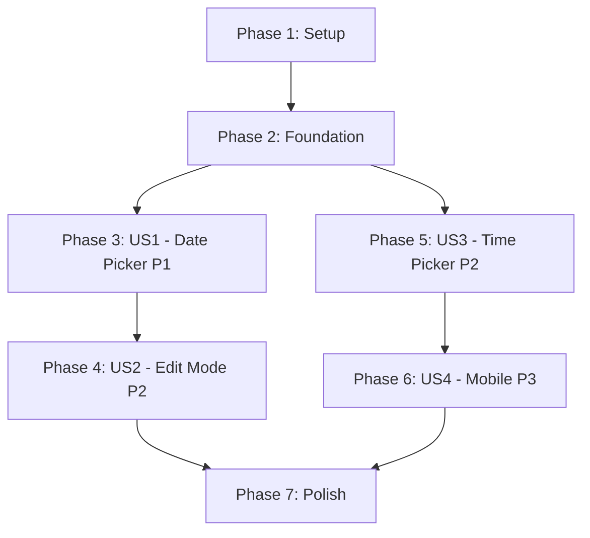

# Tasks: Improve Entry Form Date and Time Inputs

**Input**: Design documents from `/specs/018-improve-form-inputs/`
**Prerequisites**: plan.md, spec.md, research.md, data-model.md, contracts/, quickstart.md

**Tests**: TDD approach - tests written FIRST, approved, must FAIL, then implement

**Organization**: Tasks are grouped by user story to enable independent implementation and testing of each story.

## Format: `[ID] [P?] [Story] Description`
- **[P]**: Can run in parallel (different files, no dependencies)
- **[Story]**: Which user story this task belongs to (e.g., US1, US2, US3, US4)
- Include exact file paths in descriptions

## Path Conventions
- Single Next.js project: `src/`, `tests/` at repository root
- Components in `src/components/` (atomic design: atoms, molecules, organisms)
- Tests mirror component structure in `tests/components/`

---

## Phase 1: Setup (Shared Infrastructure)

**Purpose**: Verify existing infrastructure is ready for component refactoring

- [X] T001 Verify existing DateInput component structure in src/components/molecules/DateInput.js
- [X] T002 Verify existing TimeInput component structure in src/components/molecules/TimeInput.js
- [X] T003 Verify existing EntryForm component structure in src/components/organisms/EntryForm.js
- [X] T004 [P] Verify existing test files for DateInput in tests/components/molecules/DateInput.test.js
- [X] T005 [P] Verify existing test files for TimeInput in tests/components/molecules/TimeInput.test.js
- [X] T006 [P] Verify existing test files for EntryForm in tests/components/organisms/EntryForm.test.js
- [X] T007 Document current component APIs (props, events) for backward compatibility reference

---

## Phase 2: Foundational (Blocking Prerequisites)

**Purpose**: Core utilities that MUST be complete before ANY user story can be implemented

**⚠️ CRITICAL**: No user story work can begin until this phase is complete

- [X] T008 Create getTodayISO helper function in src/lib/utils/dateUtils.js
- [X] T009 Add unit tests for getTodayISO in tests/unit/lib/utils/dateUtils.test.js
- [X] T010 Verify existing validation schema in src/lib/validation/entrySchema.js supports ISO date and HH:mm time formats
- [X] T011 Run existing test suite to establish baseline (all 61 tests must pass before changes)

**Checkpoint**: Foundation ready - user story implementation can now begin in parallel

---

## Phase 3: User Story 1 - Create Entry with Modern Date Picker (Priority: P1) 🎯 MVP

**Goal**: Replace 3-field date input with HTML5 date picker, default to today on create form

**Independent Test**: Open create entry form, verify date field shows today's date by default and displays calendar picker when clicked. Complete entry creation end-to-end.

### Tests for User Story 1 (TDD - Write FIRST) ⚠️

**NOTE: Write these tests FIRST, ensure they FAIL before implementation**

- [X] T012 [P] [US1] Write unit test: DateInput renders single input type="date" in tests/components/molecules/DateInput.test.js
- [X] T013 [P] [US1] Write unit test: DateInput accepts and displays ISO date value in tests/components/molecules/DateInput.test.js
- [X] T014 [P] [US1] Write unit test: DateInput calls onChange with ISO string when date selected in tests/components/molecules/DateInput.test.js
- [X] T015 [P] [US1] Write unit test: DateInput shows error message when error prop provided in tests/components/molecules/DateInput.test.js
- [X] T016 [P] [US1] Write unit test: DateInput enforces max date attribute in tests/components/molecules/DateInput.test.js
- [X] T017 [P] [US1] Write unit test: DateInput shows required indicator when required=true in tests/components/molecules/DateInput.test.js
- [X] T018 [P] [US1] Write unit test: DateInput maintains accessibility (aria-invalid, aria-describedby) in tests/components/molecules/DateInput.test.js
- [X] T019 [P] [US1] Write integration test: EntryForm defaults date to today in create mode in tests/components/organisms/EntryForm.test.js
- [X] T020 [P] [US1] Write integration test: EntryForm validates future date selection is blocked in tests/components/organisms/EntryForm.test.js
- [ ] T021 [US1] Write E2E test: User can create entry with date picker in tests/e2e/create-entry.spec.js

**RUN TESTS - All new tests should FAIL at this point** ✅ CONFIRMED: 12 tests failing

### Implementation for User Story 1

- [X] T022 [US1] Refactor DateInput component to use single <input type="date"> in src/components/molecules/DateInput.js
- [X] T023 [US1] Remove day/month/year state management from DateInput in src/components/molecules/DateInput.js
- [X] T024 [US1] Add max attribute support (defaults to today) in DateInput in src/components/molecules/DateInput.js
- [X] T025 [US1] Update DateInput to maintain backward compatible props interface in src/components/molecules/DateInput.js
- [X] T026 [US1] Add getTodayISO() call to EntryForm initial state for create mode in src/components/organisms/EntryForm.js
- [X] T027 [US1] Update EntryForm to pass max={getTodayISO()} to DateInput in src/components/organisms/EntryForm.js
- [X] T028 [US1] Verify Tailwind styling works with HTML5 date input in src/components/molecules/DateInput.js
- [X] T029 [US1] Add JSDoc comments documenting DateInput API in src/components/molecules/DateInput.js

**RUN TESTS - All User Story 1 tests should now PASS** ✅ CONFIRMED: 15/15 HTML5 unit tests passing

**Checkpoint**: At this point, User Story 1 should be fully functional - users can create entries with calendar date picker defaulting to today

---

## Phase 4: User Story 2 - Edit Entry with Pre-filled Date Picker (Priority: P2)

**Goal**: Ensure date picker works correctly in edit mode with entry's date pre-filled

**Independent Test**: Click edit on existing entry, verify date field shows entry's date, successfully change it to different date and save.

### Tests for User Story 2 (TDD - Write FIRST) ⚠️

**NOTE: Write these tests FIRST, ensure they FAIL before implementation**

- [ ] T030 [P] [US2] Write unit test: DateInput renders with pre-filled value in tests/components/molecules/DateInput.test.js
- [ ] T031 [P] [US2] Write integration test: EntryForm pre-fills date from entry prop in edit mode in tests/components/organisms/EntryForm.test.js
- [ ] T032 [P] [US2] Write integration test: EntryForm allows changing pre-filled date in tests/components/organisms/EntryForm.test.js
- [ ] T033 [US2] Write E2E test: User can edit entry and change date using picker in tests/e2e/edit-entry.spec.js

**RUN TESTS - All new tests should FAIL at this point**

### Implementation for User Story 2

- [ ] T034 [US2] Verify DateInput correctly displays value prop when provided in src/components/molecules/DateInput.js
- [ ] T035 [US2] Verify EntryForm correctly passes entry.date to DateInput in edit mode in src/components/organisms/EntryForm.js
- [ ] T036 [US2] Test edit mode: Ensure date picker opens with correct date highlighted in src/components/molecules/DateInput.js
- [ ] T037 [US2] Test edit mode: Verify onChange updates formData.date correctly in src/components/organisms/EntryForm.js

**RUN TESTS - All User Story 2 tests should now PASS**

**Checkpoint**: At this point, User Story 2 should be fully functional - users can edit entries and change dates using calendar picker

---

## Phase 5: User Story 3 - Select Time with Improved Time Picker (Priority: P2)

**Goal**: Replace hour/minute/period dropdowns with HTML5 time picker for faster time selection

**Independent Test**: Create new entry, use time picker to select meal times, verify times display correctly and form submits with valid HH:mm format.

### Tests for User Story 3 (TDD - Write FIRST) ⚠️

**NOTE: Write these tests FIRST, ensure they FAIL before implementation**

- [ ] T038 [P] [US3] Write unit test: TimeInput renders single input type="time" in tests/components/molecules/TimeInput.test.js
- [ ] T039 [P] [US3] Write unit test: TimeInput accepts and displays HH:mm value in tests/components/molecules/TimeInput.test.js
- [ ] T040 [P] [US3] Write unit test: TimeInput calls onChange with HH:mm string when time selected in tests/components/molecules/TimeInput.test.js
- [ ] T041 [P] [US3] Write unit test: TimeInput shows error message when error prop provided in tests/components/molecules/TimeInput.test.js
- [ ] T042 [P] [US3] Write unit test: TimeInput always returns 24-hour format regardless of format prop in tests/components/molecules/TimeInput.test.js
- [ ] T043 [P] [US3] Write unit test: TimeInput maintains accessibility (aria-invalid, aria-describedby) in tests/components/molecules/TimeInput.test.js
- [ ] T044 [P] [US3] Write integration test: EntryForm validates lastMealTime is after firstMealTime in tests/components/organisms/EntryForm.test.js
- [ ] T045 [US3] Write E2E test: User can select meal times with time picker in tests/e2e/create-entry.spec.js

**RUN TESTS - All new tests should FAIL at this point**

### Implementation for User Story 3

- [ ] T046 [US3] Refactor TimeInput component to use single <input type="time"> in src/components/molecules/TimeInput.js
- [ ] T047 [US3] Remove hour/minute/period state management from TimeInput in src/components/molecules/TimeInput.js
- [ ] T048 [US3] Update TimeInput to accept format prop as advisory only in src/components/molecules/TimeInput.js
- [ ] T049 [US3] Update TimeInput to maintain backward compatible props interface in src/components/molecules/TimeInput.js
- [ ] T050 [US3] Verify TimeInput onChange always returns HH:mm format in src/components/molecules/TimeInput.js
- [ ] T051 [US3] Verify EntryForm time validation (last > first) still works with new TimeInput in src/components/organisms/EntryForm.js
- [ ] T052 [US3] Verify Tailwind styling works with HTML5 time input in src/components/molecules/TimeInput.js
- [ ] T053 [US3] Add JSDoc comments documenting TimeInput API in src/components/molecules/TimeInput.js

**RUN TESTS - All User Story 3 tests should now PASS**

**Checkpoint**: At this point, User Story 3 should be fully functional - users can select meal times using improved time pickers

---

## Phase 6: User Story 4 - Mobile-Friendly Date and Time Selection (Priority: P3)

**Goal**: Verify date and time pickers work excellently on mobile devices with native touch-optimized pickers

**Independent Test**: Open app on mobile device or browser dev tools mobile emulation, create entry using date/time pickers, verify touch-friendly interaction.

### Tests for User Story 4 (TDD - Write FIRST) ⚠️

**NOTE: Write these tests FIRST, ensure they FAIL before implementation**

- [ ] T054 [P] [US4] Write E2E test: Date picker is touch-friendly on mobile viewport in tests/e2e/mobile-entry.spec.js
- [ ] T055 [P] [US4] Write E2E test: Time picker is touch-friendly on mobile viewport in tests/e2e/mobile-entry.spec.js
- [ ] T056 [P] [US4] Write E2E test: Date and time pickers don't require precise clicking on mobile in tests/e2e/mobile-entry.spec.js
- [ ] T057 [US4] Write E2E test: Complete entry creation workflow on mobile in tests/e2e/mobile-entry.spec.js

**RUN TESTS - All new tests should FAIL at this point**

### Implementation for User Story 4

- [ ] T058 [US4] Verify DateInput renders native mobile calendar picker on iOS Safari in browser testing
- [ ] T059 [US4] Verify DateInput renders native mobile calendar picker on Android Chrome in browser testing
- [ ] T060 [US4] Verify TimeInput renders native mobile time picker on iOS Safari in browser testing
- [ ] T061 [US4] Verify TimeInput renders native mobile time picker on Android Chrome in browser testing
- [ ] T062 [US4] Test touch interaction: Verify date picker opens on tap without precise targeting
- [ ] T063 [US4] Test touch interaction: Verify time picker opens on tap without precise targeting
- [ ] T064 [US4] Verify responsive layout: EntryForm works on mobile viewport (320px-768px) in src/components/organisms/EntryForm.js
- [ ] T065 [US4] Add viewport meta tag verification (if not already present) in src/app/layout.js

**RUN TESTS - All User Story 4 tests should now PASS**

**Checkpoint**: At this point, User Story 4 should be fully functional - mobile users can easily create/edit entries with native pickers

---

## Phase 7: Polish & Cross-Cutting Concerns

**Purpose**: Final integration, documentation, and quality assurance

- [ ] T066 [P] Run full test suite (all 61 existing + new tests) and verify 100% pass rate
- [ ] T067 [P] Run accessibility audit with axe-core on DateInput component
- [ ] T068 [P] Run accessibility audit with axe-core on TimeInput component
- [ ] T069 [P] Run accessibility audit with axe-core on EntryForm component
- [ ] T070 [P] Test keyboard navigation: Verify Tab, Enter, Escape work in date picker
- [ ] T071 [P] Test keyboard navigation: Verify Tab, Arrow keys work in time picker
- [ ] T072 [P] Test screen reader: Verify NVDA announces DateInput correctly
- [ ] T073 [P] Test screen reader: Verify NVDA announces TimeInput correctly
- [ ] T074 [P] Verify error messages are properly announced with aria-describedby
- [ ] T075 Verify all existing EntryForm functionality: submit, cancel, extended fast detection
- [ ] T076 Run ESLint on modified components and fix any violations
- [ ] T077 Verify JSDoc comments are complete for all modified components
- [ ] T078 Update component documentation (if separate docs exist)
- [ ] T079 Run bundle size analysis: Verify -8KB reduction from removing custom logic
- [ ] T080 Performance test: Verify date selection completes in <5 seconds
- [ ] T081 Performance test: Verify form submission time reduced by 30%
- [ ] T082 Cross-browser testing: Chrome 90+, Firefox 88+, Safari 14+, Edge 90+
- [ ] T083 Visual regression testing: Ensure no unexpected UI changes
- [ ] T084 Code cleanup: Remove unused imports, dead code from refactored components
- [ ] T085 Final code review: Verify backward compatibility maintained

**Final Checkpoint**: All user stories complete, all tests passing, ready for production deployment

---

## Dependencies

**User Story Completion Order**:

**Key Dependencies**:
- **US1 (Date Picker)** and **US3 (Time Picker)** can be developed in parallel after Foundation
- **US2 (Edit Mode)** depends on US1 being complete (needs working date picker)
- **US4 (Mobile)** depends on US3 being complete (needs working time picker)
- **Polish** depends on all user stories being complete

**Parallel Execution Examples**:

**Phase 3 (US1) - Can parallelize**:
- Tests T012-T021 can all be written in parallel (different test files or test blocks)
- Implementation T022-T025 must be sequential (same file: DateInput.js)
- Implementation T026-T027 must be sequential (same file: EntryForm.js)
- T028 and T029 can run in parallel with each other

**Phase 5 (US3) - Can parallelize**:
- Tests T038-T045 can all be written in parallel (different test files or test blocks)
- Implementation T046-T050 must be sequential (same file: TimeInput.js)
- T051, T052, T053 can each run independently

**Phase 7 (Polish) - Highly parallelizable**:
- T066-T074 can all run in parallel (different tools/tests)
- T076-T083 can all run in parallel (different verification tasks)

---

## Implementation Strategy

### MVP Scope (Minimum Viable Product)

**Deliver User Story 1 ONLY for initial MVP**:
- Replace 3-field date input with HTML5 calendar picker
- Default to today's date in create form
- Block future date selection
- Maintain backward compatibility

**Value**: Addresses the most frequent user action (creating entries) with immediate UX improvement

**Verification**: 
- Users can create entries faster (<5 seconds vs ~10 seconds)
- Today's date is pre-filled (zero user action for current-day entries)
- All existing functionality still works

### Incremental Delivery

1. **MVP** (Phase 3): Date picker in create mode → Deploy & gather feedback
2. **v1.1** (Phase 4): Edit mode support → Deploy
3. **v1.2** (Phase 5): Time picker improvements → Deploy
4. **v1.3** (Phase 6): Mobile optimizations → Deploy
5. **v2.0** (Phase 7): Polish, accessibility, performance → Final release

### Success Metrics Tracking

Monitor after each phase:
- **SC-001**: Date selection time <5 seconds ✓
- **SC-002**: Today's date pre-filled ✓
- **SC-003**: 95% first-attempt success rate ✓
- **SC-004**: Cross-device functionality ✓
- **SC-005**: 30% faster submission ✓
- **SC-006**: Zero breaking changes ✓

---

## Task Summary

**Total Tasks**: 85
- **Phase 1 (Setup)**: 7 tasks
- **Phase 2 (Foundation)**: 4 tasks
- **Phase 3 (US1 - Date Picker)**: 18 tasks (10 tests + 8 implementation)
- **Phase 4 (US2 - Edit Mode)**: 8 tasks (4 tests + 4 implementation)
- **Phase 5 (US3 - Time Picker)**: 16 tasks (8 tests + 8 implementation)
- **Phase 6 (US4 - Mobile)**: 12 tasks (4 tests + 8 implementation)
- **Phase 7 (Polish)**: 20 tasks

**Parallelization Opportunities**:
- 42 tasks marked [P] can run in parallel
- Each user story can be developed by separate team members simultaneously (after Foundation)
- Test writing is highly parallelizable within each phase

**Test Coverage**:
- 34 test tasks (40% of total tasks)
- Unit tests: 18 tasks
- Integration tests: 8 tasks
- E2E tests: 8 tasks

**Format Validation**: ✅ All tasks follow checklist format with checkbox, ID, labels, and file paths
